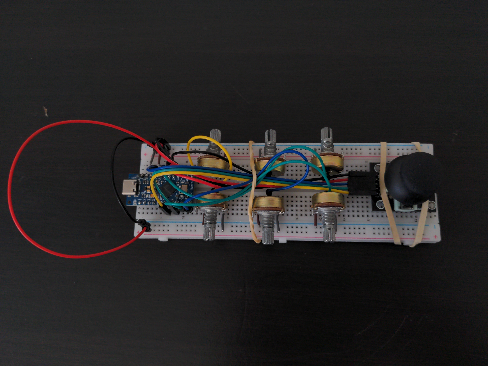
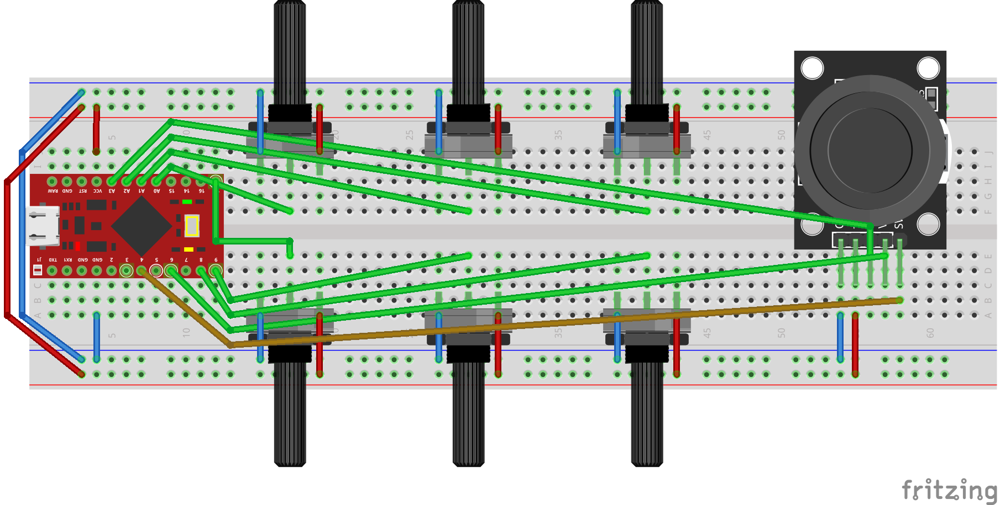
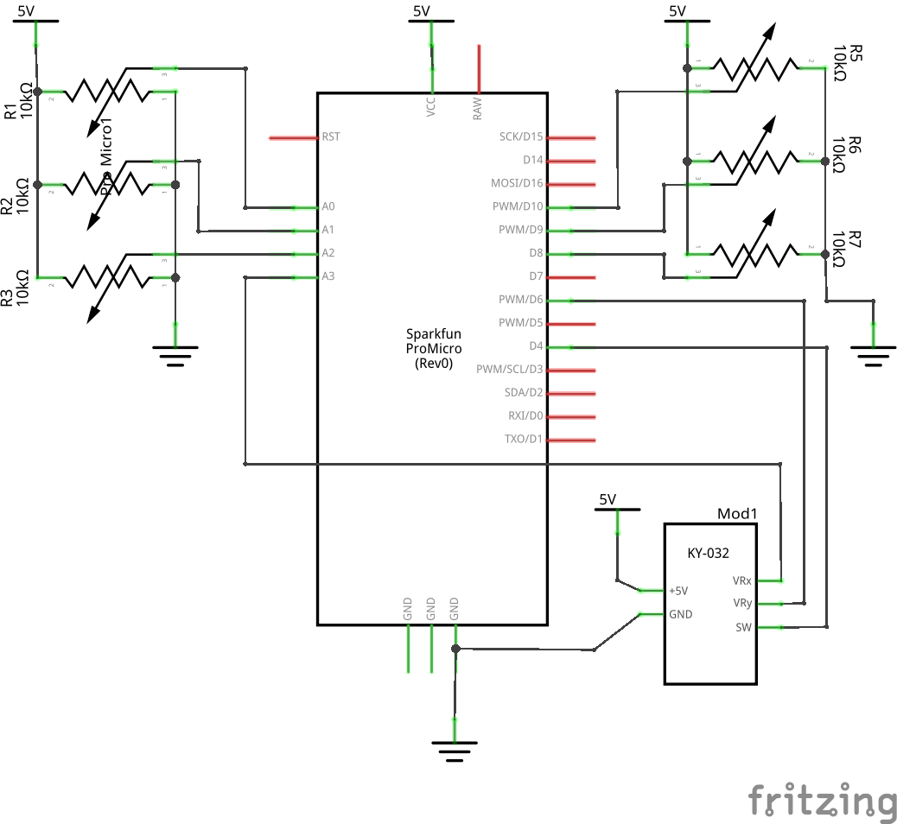
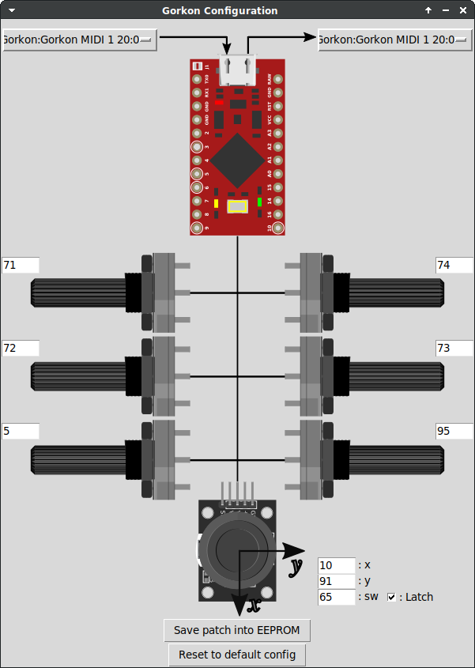

# Arduino ProMicro MIDI Gorkon

Arduino SysEx programmable 8 Knobs MIDI USB Controller

## Photo



## Breadboard



## Schematics



## Fritzing parts

[KY-023 XY Joystick (jorgechacblogspot)](https://github.com/jorgechacblogspot/librerias_fritzing/raw/main/KY-023%20Dual%20Axis%20Joystick%20Module.fzpz)

## Install libraries
### MIDIUSB
In Arduino IDE:
Sketch > Include Library > Manage Libraries > MIDIUSB

### Control Surface

Download https://github.com/tttapa/Control-Surface/archive/refs/heads/main.zip
In Arduino IDE:
Sketch > Include Library > Install from Zip

## Flash Arduino ProMicro
### Arduino IDE

* Open midi-gorkon/midi-gorkon.ino
* Sketch menu
  * Card type: `Arduino Micro`
  * Port: `/dev/ttyACM0`
  * Upload

### Command line (Ubuntu/Debian)

```shell
# Install dependencies
sudo apt install arduino-mk

# Compile and upload
cd midi-gorkon
make upload
```

## Gorkon Configuration App (Ubuntu/Debian)

```shell
# Install dependencies
sudo apt install python3-rtmidi

# Launch using Jack
./gorkon-config
# Launch using Alsa
./gorkon-config -a
```


